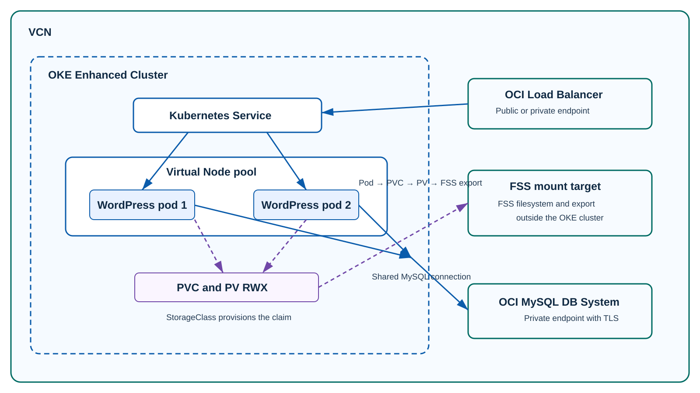

# Build Stateful Kubernetes Applications on OKE Virtual Nodes with OCI File Storage

OCI Kubernetes Engine, or OKE, Virtual Nodes offer a serverless Kubernetes experience. Kubernetes schedules pods while OCI operates the underlying worker infrastructure. That model removes the need to provision, patch, scale, or maintain node pools for the application.

For a long time, however, one important question limited which workloads were a good fit. Where does durable application data live when the pod itself is ephemeral?

Persistent storage with OCI File Storage, or FSS, answers that question. FSS-backed persistent volumes are now available for OKE Virtual Nodes, giving workloads durable shared filesystem storage without giving up the serverless operating model.

## What FSS adds to Virtual Nodes

Pods can restart, be replaced, or move as an application scales. Files kept only in a container disappear with that pod. With FSS, applications use the standard Kubernetes PersistentVolumeClaim, or PVC, model to retain files beyond the lifecycle of an individual pod.

FSS supports `ReadWriteMany`, or RWX, which lets multiple pods mount the same filesystem for read and write access. That makes Virtual Nodes suitable for workloads such as content services, shared build workspaces, data-processing pipelines, and AI or machine-learning artifacts.

The FSS CSI driver can dynamically provision storage from a StorageClass and PVC, or it can connect a pre-created FSS export through a PersistentVolume. This WordPress example uses dynamic provisioning.

## Why WordPress fits the pattern

WordPress stores two kinds of state. MySQL holds posts, users, settings, and comments. FSS holds uploads, themes, plugins, and the rest of `wp-content`. Keeping those responsibilities separate allows two WordPress replicas to serve one site.

| State | Location |
| --- | --- |
| Database records | External MySQL |
| Shared WordPress files | FSS RWX volume |
| Web-serving compute | OKE Virtual Nodes |

Both pods mount the same FSS-backed PVC and use the same MySQL database. The Helm chart also gives each replica the same WordPress authentication keys and salts, so requests can safely reach either pod without sticky sessions.

## Architecture

An OCI Load Balancer distributes traffic to WordPress pods in a Virtual Node pool. The pods use the PVC and PV layer to access the FSS mount target and export, and they use a private MySQL endpoint for relational data.



FSS and its mount target are OCI resources in the VCN, outside the OKE cluster boundary. The path is pod to PVC to PV to FSS export. A StorageClass defines how Kubernetes provisions the PVC. It is not mounted directly by a pod.

## Deploy the infrastructure and application

[](https://cloud.oracle.com/resourcemanager/stacks/create?zipUrl=https://github.com/chiphwang1/oke-virtual-nodes-fss-wordpress/releases/download/v0.1.1/oke-vn-fss-wordpress-orm.zip)

The Resource Manager stack can use an existing Enhanced OKE cluster or create one. It creates the Virtual Node pool and prompts for FSS and MySQL prerequisites. Creating MySQL incurs service charges. The stack provisions OCI infrastructure only.

After the stack completes, deploy WordPress with the included [Helm chart](https://github.com/chiphwang1/oke-virtual-nodes-fss-wordpress/tree/main/helm/wordpress-virtual-fss). Create a `wordpress-db` Secret with `host`, `database`, `username`, and `password` keys, then install the chart.

```bash
git clone https://github.com/chiphwang1/oke-virtual-nodes-fss-wordpress.git
helm upgrade --install wordpress \
  ./oke-virtual-nodes-fss-wordpress/helm/wordpress-virtual-fss \
  --namespace wordpress --create-namespace \
  --set fss.availabilityDomain='<availability-domain>' \
  --set fss.compartmentOcid='<compartment-ocid>' \
  --set fss.mountTargetSubnetOcid='<mount-target-subnet-ocid>'
```

Use `fss.mode=dynamic-existing-mount-target` with `fss.mountTargetOcid` when the CSI driver should use an existing mount target. Enable `mysql.tls.enabled` only after MySQL TLS is configured and tested.

## Validate and operate

```bash
kubectl -n wordpress get pvc,pods,service
kubectl -n wordpress rollout status deployment/wordpress
```

You are ready to continue when the PVC is `Bound`, both WordPress pods are `Ready`, and the LoadBalancer Service has an external address. Upload a file, then retrieve it through both pods to confirm that FSS content is shared. Finally, create and read WordPress content to confirm the MySQL connection works.

The chart starts two replicas and places them on separate Virtual Nodes. If the pool has only two usable Virtual Nodes, a third replica stays Pending. Add Virtual Node capacity before increasing the replica count or configuring an HPA above two replicas.

The PVC capacity request is required by Kubernetes, but it does not set a fixed FSS filesystem size. Plan FSS capacity and cost separately. The example StorageClass uses `Retain`, which keeps FSS data after the PVC is deleted. Define backup, retention, and cleanup procedures before deploying the application.

## Cleanup

Run `helm uninstall wordpress --namespace wordpress`, then review the Resource Manager stack, FSS exports, file systems, mount targets, and MySQL DB Systems before deleting them. Retained FSS data and MySQL resources can continue to incur charges.

## Conclusion

FSS-backed persistent volumes extend OKE Virtual Nodes to applications that need durable shared files. Virtual Nodes run the web tier, MySQL stores relational data, and FSS stores shared application content. Together, they provide a Kubernetes-native way to run file-oriented stateful applications without managing worker nodes.
