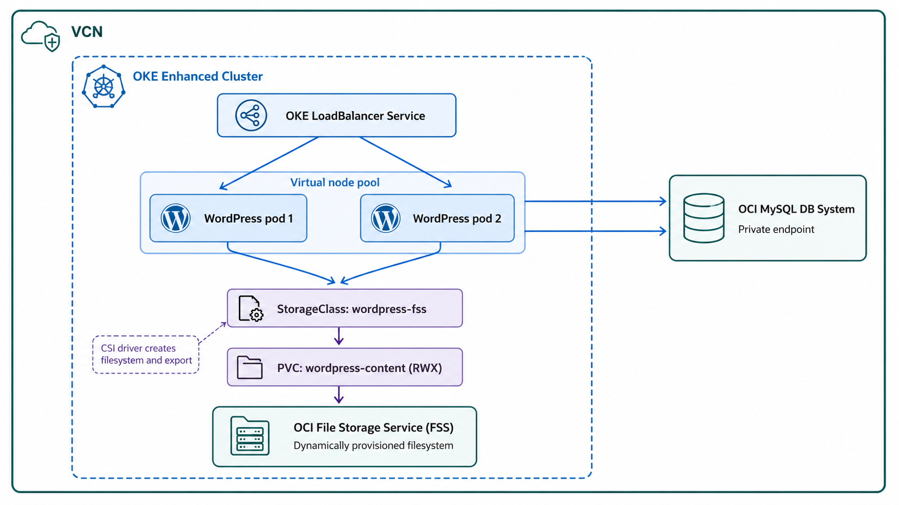

# Build Stateful Kubernetes Applications on OKE Virtual Nodes with OCI File Storage

OCI Kubernetes Engine, or OKE, Virtual Nodes provide a serverless Kubernetes experience without customer-managed worker nodes. Persistent data needs a separate design because pods can be replaced at any time.

OCI File Storage, or FSS, provides durable shared filesystem storage through the Kubernetes PVC model. It is useful for workloads that need shared files, including uploads, build artifacts, shared workspaces, and model artifacts.

## Deploy this pattern

Use the Deploy to Oracle Cloud button to launch the accompanying Resource Manager stack. It prompts for an existing or new OKE cluster, an existing or new FSS share, and an existing or new external MySQL service.

After the stack completes, deploy WordPress with the included [WordPress Helm chart](https://github.com/chiphwang1/oke-virtual-nodes-fss-wordpress/tree/main/helm/wordpress-virtual-fss). The Resource Manager stack provisions the OCI infrastructure but does not install the Helm release.

## WordPress state separation

WordPress has two forms of state that belong in different services.

| State | Location |
| --- | --- |
| Posts, users, settings, and comments | External MySQL |
| Uploads, themes, plugins, and `wp-content` files | FSS RWX volume |
| Web-serving compute | OKE Virtual Nodes |

The WordPress replicas mount the same FSS claim at `/var/www/html/wp-content` and connect to one external MySQL database. FSS is for shared files, not relational database state.

## Scaling

The example uses two replicas with anti-affinity. Do not configure application scaling beyond the Virtual Node capacity and topology available to the deployment.

## Production guidance

- Use a highly available database for production.
- Use Vault or an approved secret-delivery method for credentials and WordPress salts.
- Add TLS, a DNS name, health probes, resource requests and limits, and a rolling-update policy before exposing the site.
- Pin the WordPress image to a tested version or digest.
- A PVC capacity request is required by Kubernetes but does not create a fixed-size FSS filesystem. Plan FSS capacity and cost separately.
- `Retain` leaves FSS data behind after PVC deletion. Define backups, restore tests, and cleanup procedures.

## Conclusion

FSS expands the file-oriented workloads that can be evaluated on OKE Virtual Nodes. The practical split is straightforward. Virtual Nodes run the web tier, MySQL stores relational data, and FSS stores shared application files.
